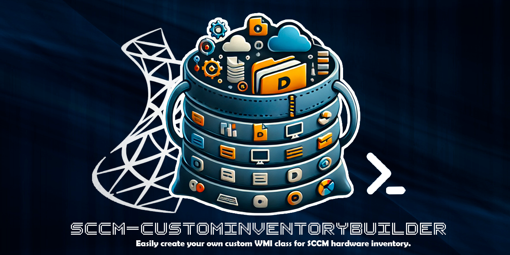

# Powershell : SCCM Create Custom Inventory

These scripts can be used in the SCCM console compliance settings to generate new WMI classes and instances on computers to be collected by CCM client hardware inventories.

## Template 

I made two templates for Operating System Windows 7 and for Windows 10 and higher.
Windows 7 version use WMIObject and the other use CIMObject on Namespace `Root\cimv2`

|OS | Templates   |
|-----------|-----------|
|Windows 7 | [Template/CustomInv-Template.ps1](./Template/CustomInv-Template-Win10.ps1) |
|Windows 10 | [Template/CustomInv-Template.ps1](./Template/CustomInv-Template-Win7.ps1) |

### How To use the template

1. **Generate your Class Template** (l.137)
    
    ```
    #region Custom Class Definition
    $CurrentClassName = "CustomInventory_YourCustomName"

    $TemplateObject = New-Object PSObject
    $TemplateObject | Add-Member -MemberType NoteProperty -Name "CustomProp1" -Value $null
    $TemplateObject | Add-Member -MemberType NoteProperty -Name "CustomProp2" -Value $null
    #endregion Custom Class Definition
    ```

- Set your CustomInventory ClassName using the variable `$CurrentClassName`
- Use only `-MemberType Noteproperty` to create your custom properties and set is value to `$null`
- Don't Rename the variable `$TemplateObject` it will be used to create the Cim/WMI Class


2. **Generate your own code** (Begin at l.149)

   The objective is to create your powershell objects and integrate them into the $InstancesObjectArray array which will then be used to generate all the instances.
   ```
    #region Custom Code
    <#
    Put your code for generating one or several Instance Object, you need to respect template object Property
    You can Add Key Property value if you want customize it, else a GUID is generated for the instance key
    EXAMPLE :  
    #>

    $MyObjectInstance = New-Object PSObject
    #$MyObjectInstance | Add-Member -MemberType NoteProperty -Name "Key" -Value "CustomKey"
    $MyObjectInstance | Add-Member -MemberType NoteProperty -Name "CustomProp1" -Value "SetValue1"
    $MyObjectInstance | Add-Member -MemberType NoteProperty -Name "CustomProp2" -Value "SetValue2"
    
    #Add Your Object to The ArrayList
    $InstancesObjectArray.Add($MyObjectInstance) | Out-Null

    #endregion Custom Code
   ```

   Your instances Object must have the same property of your Template Object, but you can add a special property `key` if you want customize his value. 
   
   By Default de `key` Property of instance is a GUID.

   ```
    $MyObjectInstance = New-Object PSObject
    #(Optional) $MyObjectInstance | Add-Member -MemberType NoteProperty -Name "Key" -Value "CustomKey"
    $MyObjectInstance | Add-Member -MemberType NoteProperty -Name "CustomProp1" -Value "SetValue1"
    $MyObjectInstance | Add-Member -MemberType NoteProperty -Name "CustomProp2" -Value "SetValue2"
   ```

## Ready To Use Scripts

I created some ready-to-use custom inventory scripts.

For each there is a version for Windows 7 and a version for Windows 10 and higher.
It is advisable, if you use the 2 versions of the same script, to keep the same class name for simplified use in MECM and not to increase the number of WMI elements unnecessarily

|Script|Description|Win7|Win10|
|------|------|------|------|
|LocalAdmin| Obtain the list of members of the local machine administrators group and retrieve object information from an Active Directory domain  |[Link](./CustomInventories/CustomInv-LocalAdmin-Win7.ps1)|[Link](./CustomInventories/CustomInv-LocalAdmin-Win10.ps1) |
|OracleClient| Retrieves information on the Oracle client installations installed by the OUI (Oracle_Home, Dll version, Architecture, etc.) |[Link](./CustomInventories/CustomInv-OracleClient-Win7.ps1)|[Link](./CustomInventories/CustomInv-OracleClient-Win10.ps1) |
|PnPDrivers| Retrieves all information from the drivers installed on the machine. Drivers are not inventoried by SCCM by default |[Link](./CustomInventories/CustomInv-PnPDrivers-Win7.ps1)|[Link](./CustomInventories/CustomInv-PnPDrivers-Win10.ps1) |
|SMB1Protocol| Check if SMB1 protocol is Enabled or Disables on computer |[Link](./CustomInventories/CustomInv-SMB1Protocol-Win7.ps1)|[Link](./CustomInventories/CustomInv-SMB1Protocol-Win10.ps1) |
|UsersProfiles| Retrieves the list of profiles or sessions created on a computer, if it is a domain profile, then information is retrieved from Active Directory. Also retrieves the size of profiles and some user directories. |[Link](./CustomInventories/CustomInv-UsersProfiles-Win7.ps1)|[Link](./CustomInventories/CustomInv-UsersProfiles-Win10.ps1) |

## Clean up obsolete objects and classes
If there are objects and classes that are no longer used, don't forget to clean them up on your IT equipment.
Similar to other scripts, you can create a new rule in SCCM Compliances to run the following scripts :

|OS | Templates   |
|-----------|-----------|
|Windows 7 | [ClearInventories/ClearInv-Win7.ps1](./ClearInventories/ClearInv-Win7.ps1) |
|Windows 10 | [ClearInventories/ClearInv-Win10.ps1](./ClearInventories/ClearInv-Win10.ps1) |

You have just to add your className into the array (l.49) :
```
$ClassNameList = @(
        "ClassName1",
        "ClassName2"
    )
```

## Configure SCCM Compliance Settings

1. Create new Configuration item
    - Set a Configuration item Name and description
    - Select your supported plateform for your configuration item
    - In Settings, add new Setting, set Name and Description and select **SettingType = Script** and **DataType = Integer**
    - Put your CustomInventory Script into **Discovery Script**
    - In Compliance rules, **Add** New Rule
        - Set Name and Description for the rules
        - Select **RuleType = value**
        - Select **Operator = Equals**
        - Set **Folowing Value** to **0** (It's the value return by script when ran is OK)
- Complete the Item Configuration Window
- Set the prerequistes OS if the script must be execute on Windows 7 or Windows 10 OS.

2. Create a new configuration baseline
    - Set a baseline name and description
    - In **Configuration Data** add *Configuration Item*
    - Select your Item configuration for CustomInventory

3. Deploy Your BaseLine in to Device Collection

4. In Administration Panel > Client Settings > Default Client Settings
    - In Hardware Invetory Setting, You need to add the new WMI Class > **Set Classes**
    - Click **Add** and click **Connect**
    - Select your WMI Namespace and **Connect**
    - Now Select your new wmi class (if you have run th script first on your machine),
    - Click OK and uncheck on the main WMI Class list which where invotoried by CCM agent.

5. In your real Client Settings
    - In Hardware Inventory, **Set Classes**, you can now re-select your class and the property you want.

## Releases

- Version `1.0`  | 2024-09-26

## 🔗 Links
https://github.com/Letalys/SCCM-CustomInventoryBuilder

## Autor
- [@Letalys - Christophe GOEMAERE (GitHUb)](https://www.github.com/Letalys)
